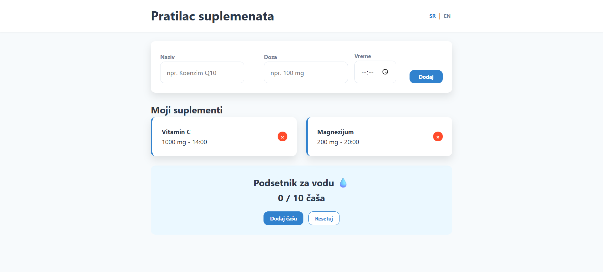

# 💊 Supplement Tracker (with i18n, LocalStorage & Smart Reminders)

## 📸 Preview

A professional, fully responsive web application designed to help users manage their daily supplement intake and maintain optimal hydration levels with integrated smart notifications.

## 🔬 The Intersection of Chemistry & Code

As a **Master of Chemistry**, I developed this project with a focus on precision and the automation of laboratory-style routines.

- **Domain Expertise:** Development was driven by the need for accurate dosage tracking, mirroring the precision required in analytical chemistry.
- **Future Vision:** This tracker serves as the foundation for future projects, such as molar mass calculators and laboratory solution management tools.

## 🌟 Features

- **Smart Reminders:** Real-time system notifications utilizing the **Browser Notification API** to ensure you never miss a dose.
- **Modern Design System:** Built with **CSS Custom Properties (Variables)** for a clean, consistent, and easily maintainable UI.
- **Supplement Management:** Easily add and track supplements with specific names, dosages, and timings.
- **Multi-language Support (i18n):** Instant toggle between English and Serbian languages.
- **Hydration Tracker:** Integrated water intake counter with a dynamic goal display and local persistence.
- **Data Persistence:** Uses `LocalStorage` to ensure all your data remains saved even after closing the browser.
- **Responsive Design:** Optimized for mobile, tablets, and desktops using advanced CSS Media Queries.

## 🛠️ Tech Stack

- **HTML5:** Semantic structure focusing on accessibility and clear document flow.
- **CSS3:** Custom styling using Flexbox, Grid, and **CSS Variables** for a robust design system.
- **JavaScript (ES6+):**
  - **Browser APIs:** Notification API and LocalStorage.
  - **Async Logic:** `setInterval` for real-time time monitoring and alarm triggering.
  - **State Management:** Efficient data manipulation using Array methods and JSON serialization.

## 🧪 Educational Goals & Learning Outcomes

This project demonstrates proficiency in:

1. **Browser Notification API:** Implementing real-time communication between the web app and the OS.
2. **Advanced CSS Architectures:** Using variables to create a scalable and theme-ready codebase.
3. **Internationalization (i18n):** Implementing a scalable dictionary-based translation system.
4. **Persistent Storage:** Mastering the lifecycle of data within the browser's `LocalStorage`.

## 🚀 Installation & Usage

1. Clone the repository or download the source code.
2. Open `index.html` in any modern web browser.
3. Allow notifications when prompted to enable smart reminders.
4. Start tracking your health routine immediately!

---

### 👩‍🔬 Author

**[Ivana Tatić]**
_Master of Organic Chemistry & Aspiring Web Developer_

Feel free to connect or check out my other projects!
